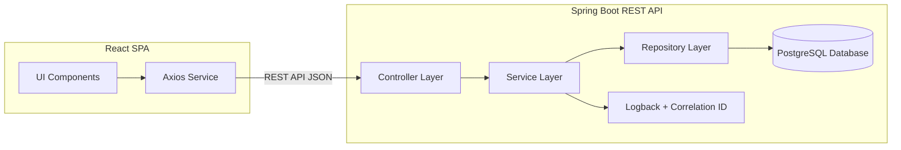

# 🧩 System Architecture

## Description

The React SPA communicates with the Spring Boot REST API using JSON over HTTP.

The backend is layered:

- **Controller**: Handles HTTP requests and responses.
- **Service**: Contains business logic.
- **Repository**: Manages database access through JPA/Hibernate.

All logs include a Correlation ID for traceability.
